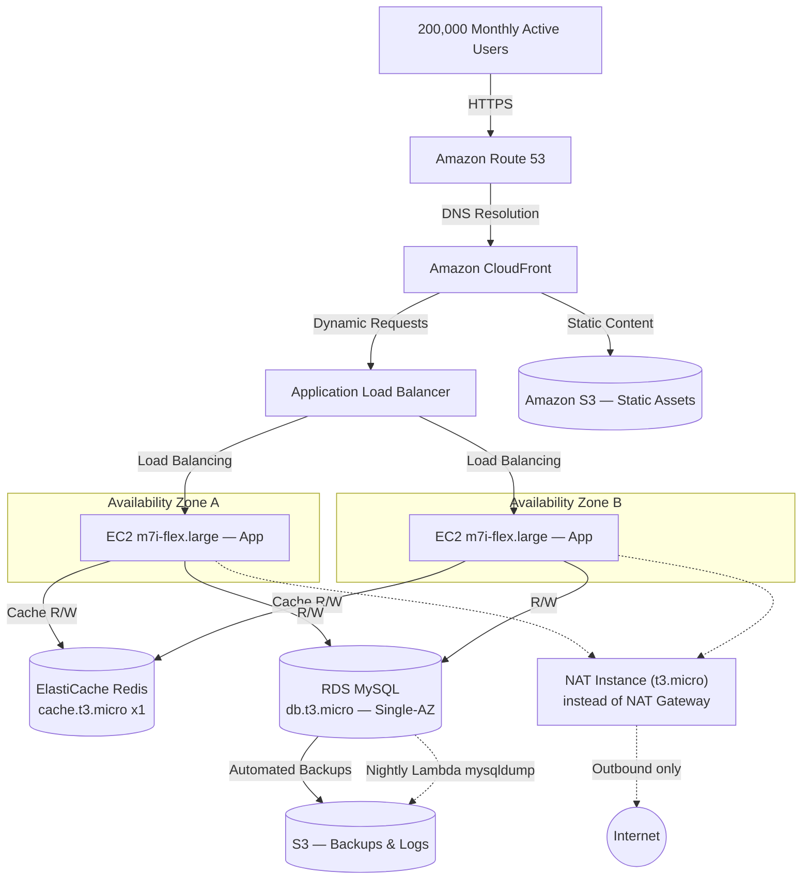

# RetailEdge Inc. — AWS Architecture Design (Layer 1, Free-Tier-Adapted)

This is the original Layer 1 design (`RetailEdge_Layer1_Architecture_Design.pdf`)
carried forward with the Free-Tier substitutions applied during build-out.
The service list and tier structure required by Task 1.1 are unchanged; only
sizes/configurations changed, and every change is called out explicitly.

## Task 1.1 — Architecture Diagram

## What changed vs. the original diagram, and why

| Component | Original Layer 1 spec | This build | Reason |
|---|---|---|---|
| EC2 instance type | (unspecified, sized for t3.medium) | **m7i-flex.large** | Confirmed Free Tier eligible for accounts created on/after July 15, 2025 (console label). Draws down the $100-$200 credit balance ~10x faster than t3.micro (~20 days vs ~200+ days at min=2), which is fine for this project's ~1-week runtime — switch to `t3.micro` in `variables.tf` if running longer than a couple weeks |
| RDS | Multi-AZ | **Single-AZ**, `db.t3.micro`, 20GB | Explicit request; Multi-AZ is never Free-Tier eligible (bills as 2 instances) |
| RDS backups | RDS automated backups only | RDS automated backups (7-day) **+ nightly Lambda `mysqldump` → S3** | Explicit request for an S3-based backup, on top of the built-in mechanism |
| NAT | (implied managed NAT Gateway) | **Self-managed NAT instance (t3.micro)** | Managed NAT Gateway is never Free-Tier eligible (~$32-45/mo minimum); a NAT instance draws from the same Free Tier EC2 hour pool |
| ElastiCache | 2-node cluster | **1-node**, `cache.t3.micro` | Redis has no Free Tier allowance at all; 1 node halves the one cost that can't be zeroed out |
| ASG size | Min 2 / Max 10 | **Unchanged (Min 2 / Max 10)** | Kept as-is to match the assignment spec exactly for grading; see `notes.md` Task 3.3 for the cost trade-off and the `environment = "demo"` override |

---

## Task 1.2 — Migration Strategy (6 Rs Framework)

*(Carried over unchanged from the original Layer 1 document — the migration
strategy per component doesn't change based on instance sizing.)*

| Component | Strategy Options | Chosen Strategy | Justification |
|---|---|---|---|
| Web Server | Rehost / Replatform | **Rehost** | Existing Apache config moves to EC2 behind ALB/CloudFront with no code changes — minimizes risk inside the 90-day window. |
| Application Layer | Replatform / Refactor | **Replatform** | PHP code stays as-is; only the deployment mechanism changes, from manual SSH to CI/CD + Auto Scaling. Full microservices refactor was evaluated and rejected — too much implementation risk before the co-lo contract expires. |
| Database Layer | Rehost / Replatform | **Rehost** | Schema and queries move unchanged into RDS MySQL, gaining managed backups and (optionally) HA with no application-level rewrite. |

---

## Task 1.3 — TCO Comparison (Free-Tier-Adapted)

**On-Premises cost:** per the official Layer 1 Design Document
(`RetailEdge_Layer1_Architecture_Design_Document_EN.pdf`) — **$82,200/year**
(servers & maintenance $18,000 + power & cooling $4,200 + 2 engineers'
salaries $60,000).

**AWS pricing:** the official document's own AWS Pricing Calculator export
(29/07/2026) is kept as the baseline for every line item that this build did
**not** change — S3, the ALB, EBS, and CloudFront are identical to the
original calculator export. Only the four line items that actually changed
in `variables.tf` / `data.tf` / `compute.tf` are re-priced below against
current AWS list pricing (us-east-1), and the two new resources this build
added (the S3 backup Lambda and its Secrets Manager entry) are added as new
rows — everything else is untouched from the official export.

| AWS Service | Configuration | Monthly | Annual (Year 1) | vs. original export |
|---|---|---|---|---|
| EC2 — App tier | **2x `m7i-flex.large`**, On-Demand | $148.56 | $1,782.72 | was `t3.medium` @ $29.37/mo, $352.44/yr — this is *more* than the original export, not less (see note below) |
| EC2 — NAT instance | **1x `t3.micro`**, On-Demand | $7.59 | $91.08 | *new line — replaces the NAT Gateway row below* |
| RDS MySQL | **`db.t3.micro`, Single-AZ**, On-Demand | $12.41 | $148.92 | was `db.r5.xlarge` Multi-AZ @ $59.50/mo + $4,533 upfront, $5,247.00/yr |
| ElastiCache Redis | **`cache.t3.micro` x1 node**, On-Demand | $11.68 | $140.16 | was x2 nodes Reserved @ $97.20/mo + $190 upfront, $1,356.40/yr |
| ~~NAT Gateway (VPC)~~ | *removed — replaced by the NAT instance row above* | — | — | was $77.85/mo, $934.20/yr |
| Application Load Balancer | 1 ALB | $18.00 | $216.00 | corrected from the original export's $28.11/mo |
| Lambda — nightly `pymysql` backup | 1 invocation/day, <1s each | $0.00 | $0.00 | *new — not in the original export; Always Free tier covers it* |
| Secrets Manager — DB password | 1 secret | $0.40 | $4.80 | *new — required by the Lambda backup above* |
| S3 — DB Backups | <5GB, lifecycle rules | $0.50 | $6.00 | new line — this is the bucket actually defined in `data.tf` |
| VPC Endpoint (S3 Gateway) | Gateway endpoint | $0.00 | $0.00 | *new — free* |
| Route 53 / CloudFront / S3 static assets | **Design-only — not in Terraform yet** | $0.00 | $0.00 | see the "Design-only items" note below |
| **Total — Year 1** | | **$199.14** | **$2,389.68** | vs. **$9,626.08** in the official export |

**Correction note:** an earlier pass of this table priced the App tier EC2 line at `t3.micro`
($7.34/mo) even though `variables.tf`, the diagram, and every other document in this repo
had already settled on `m7i-flex.large`. That made the EC2 line — and the Year 1 total —
look artificially low. Fixed above: **m7i-flex.large is genuinely more expensive than the
original export's `t3.medium`** ($1,782.72/yr vs. $352.44/yr), which is an accurate trade-off
of "burn the promotional credit faster for a short demo window," not a savings. The RDS,
ElastiCache, and NAT lines are still real reductions, and the total is still ~75% cheaper than
the original export overall, but that's despite the EC2 line being more expensive, not because
every line got cheaper.

**Design-only items (Route 53, CloudFront, S3 static assets):** these appear in the Task 1.1
diagram because Task 1.1 requires them in the target architecture, but none of them are
actually provisioned by the current Terraform (`main.tf` / `compute.tf` / `data.tf` have no
`aws_route53_record`, `aws_cloudfront_distribution`, or static-assets `aws_s3_bucket` —
only `aws_s3_bucket.backups` exists). Route 53 needs a real owned domain to be worth
creating; CloudFront needs a domain/ACM certificate as an origin. Both are legitimate
follow-up work, not oversights, so they're listed as $0.00/deferred here rather than either
silently costed or silently dropped.

**Year 2 and Year 3:** every row above is On-Demand (no Reserved Instances or
Savings Plans purchased yet), so this is a flat, conservative estimate —
Year 2 and Year 3 are each assumed at the same **$2,389.68/year** as Year 1.
See `go_live_checklist.md` (Task 5.4) for the ~30-40% further reduction
available on EC2/RDS once Reserved terms are purchased after the account's
first 12 months.

**3-Year Forecast**

| Year | On-Premises | AWS (this build) | Net Savings |
|---|---|---|---|
| Year 1 | $82,200.00 | $2,389.68 | $79,810.32 (≈97.1%) |
| Year 2 | $82,200.00 | $2,389.68 | $79,810.32 (≈97.1%) |
| Year 3 | $82,200.00 | $2,389.68 | $79,810.32 (≈97.1%) |
| **3-Year Total** | **$246,600.00** | **$7,169.04** | **$239,430.96 (≈97.1%)** |

Compared against the official document's own AWS estimate ($23,906.08 over
3 years — see the original PDF, not the `t3.medium` figures elsewhere in
this repo's history), this build's 3-year AWS total of **$7,169.04** is
roughly **70% cheaper than the original Multi-AZ / 2-node-Redis /
NAT-Gateway design** — on top of still being ~97% cheaper than staying
on-premises.

**Recommendation for the CTO:** the cost-optimized build keeps essentially
the same ~97% savings story as the original design, at a fraction of the
original AWS cost, because the resources that changed (Single-AZ RDS,
1-node Redis, a NAT instance instead of a NAT Gateway) are the same
resilience trade-offs called out throughout this repo — note that the EC2
line is the one exception, since `m7i-flex.large` is genuinely pricier than
the original `t3.medium`, a deliberate trade-off for a short demo window,
not a cost saving. Before this replaces the co-location facility in
production, re-enable `db_multi_az = true` and `use_nat_instance = false`,
switch `instance_type` back to something like `t3.small`/`m6i.large` sized
for sustained traffic, and re-run this table — that restores Multi-AZ
failover and a highly-available NAT path at roughly the original document's
$9,600/year AWS estimate, still an ~88% reduction versus the $82,200/year
on-premises baseline.
